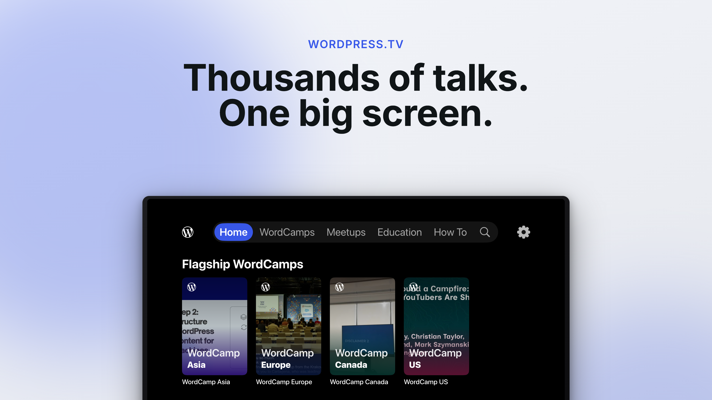

# WordPress.tv app 

A monorepo for the native **WordPress.tv** TV apps — browse and watch [WordPress.tv](https://wordpress.tv) talks, tutorials, and WordCamp sessions on the couch.

## Platforms

| Platform | Path | Status | Getting started |
| --- | --- | --- | --- |
| Apple TV (tvOS) | [`apple/`](apple) | ✅ Builds, tests, ships to TestFlight | [apple/README.md](apple/README.md) |
| Google TV (Android) | [`android/`](android) | ✅ Builds, tests, assembles a debug APK | [android/README.md](android/README.md) |

Each platform owns its UI under its directory: open `apple/` in Xcode, open `android/` in Android Studio. Data/domain code lives once in [`shared/`](shared) and is consumed as an Android library variant by Google TV and as a generated static framework by tvOS.
